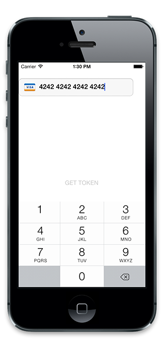

CEStripe
===========================================

This is a wrapper around the [Stripe iOS SDK](https://stripe.com/docs/mobile/ios)
It is used to send payment card details to the Stripe backend and return a Single Use Token for use in your server-side.

This current version create a STP View object, I'll wrap in the iOS Bindings in a later version.

**iOS only** at the moment.

## Quick Start

### Get it 
Download the latest distribution ZIP-file and consult the [Titanium Documentation](http://docs.appcelerator.com/titanium/latest/#!/guide/Using_a_Module) on how install it, or simply use the [gitTio CLI](http://gitt.io/cli):

`$ gittio install co.coolelephant.stripe`

### Usage

	var CEStripeIOS = require('co.coolelephant.stripe');

    var stripeView = CEStripeIOS.createView({
	    top: 40,
	    width: Ti.UI.FILL,
	    height: Ti.UI.FILL,
	    paymentKey: '<YOUR PUBLISHABLE KEY>' //Required: Stripe PublishableKey
    });
    
    stripeView.addEventListener('error', function(e){
    
	    Ti.API.debug('error: ', e.value);
	    
    });
    stripeView.addEventListener('receivedToken', function(e){
    
	    Ti.API.debug('receivedToken: ', e.value);
	    
    });
    stripeView.addEventListener('cardIsValid', function(e){
    
	    Ti.API.debug('cardIsValid: ', e.value);
	    
    });
	win.add(stripeView);

Please see the example included with this module.

## Options

#### paymentKey

Type: `String`  
Default: None (required)

Stripe Publishable Key (API key).

## Events

### cardIsValid
Fired once you have filled in the card number, tells you whether the card number is of a valid format.

##### value
Type: `Boolean`   

### receivedToken
Fired once a Single Use paymentToken has been successfully received from the Stripe gateway.

##### value
Type: `String`   
payment Token.

### error
Received when an error has been received from the token request.

##### value
Type: `String`   
Description of the error.

## Changelog

* v1.0  
  * initial version
* v1.1
  * modified repo
* v1.2
  * minor fixes
* v1.2
  * Updated to latest Stripe PaymentKit

##ABOUT THE AUTHOR
Cool Elephant is a front to back end system integration company with a special focus on mobile application design, development and integration. Titanium Appcelerator is one of our specialities!

web: [Cool Elephant](http://coolelephant.co.uk)  
twitter: [@coolelephant](https://twitter.com/coolelephant)  
email: trunk@coolelephant.co.uk

## License

    Copyright (c) 2010-2014 Cool Elephant Ltd

    Permission is hereby granted, free of charge, to any person obtaining a copy
    of this software and associated documentation files (the "Software"), to deal
    in the Software without restriction, including without limitation the rights
    to use, copy, modify, merge, publish, distribute, sublicense, and/or sell
    copies of the Software, and to permit persons to whom the Software is
    furnished to do so, subject to the following conditions:

    The above copyright notice and this permission notice shall be included in
    all copies or substantial portions of the Software.

    THE SOFTWARE IS PROVIDED "AS IS", WITHOUT WARRANTY OF ANY KIND, EXPRESS OR
    IMPLIED, INCLUDING BUT NOT LIMITED TO THE WARRANTIES OF MERCHANTABILITY,
    FITNESS FOR A PARTICULAR PURPOSE AND NONINFRINGEMENT. IN NO EVENT SHALL THE
    AUTHORS OR COPYRIGHT HOLDERS BE LIABLE FOR ANY CLAIM, DAMAGES OR OTHER
    LIABILITY, WHETHER IN AN ACTION OF CONTRACT, TORT OR OTHERWISE, ARISING FROM,
    OUT OF OR IN CONNECTION WITH THE SOFTWARE OR THE USE OR OTHER DEALINGS IN
    THE SOFTWARE.
